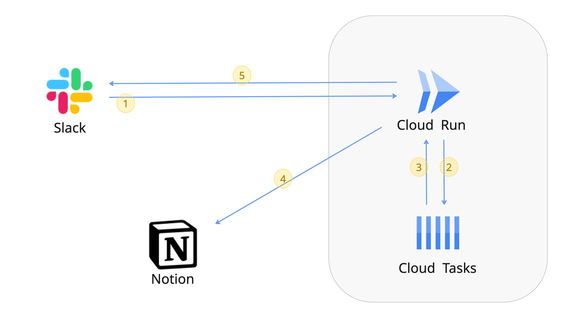
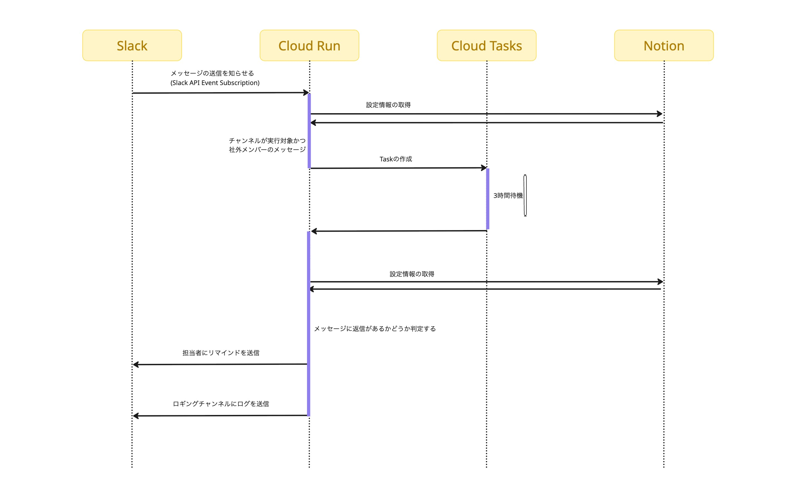

# Slack Response Reminder

[](https://www.python.org/downloads/)
[](https://fastapi.tiangolo.com/)
[](https://slack.dev/python-slack-sdk/)

Slackで社外チャンネルのクライアントのメッセージに３時間返信がなければ、DMでリマインドを送信するアプリケーションです。

## 📋 目次

- [概要](#概要)
- [構成図](#構成図)
- [タイムラインチャート](#タイムラインチャート)
- [機能](#機能)
- [技術スタック](#技術スタック)
- [前提条件](#前提条件)
- [プロジェクト構造](#プロジェクト構造)
- [API エンドポイント](#api-エンドポイント)
- [ライセンス](#ライセンス)

## 概要

このアプリケーションは、Slackの社外チャンネルでクライアントからのメッセージに対する返信を監視し、指定時間（3時間）以内に返信がない場合に担当者にリマインドDMを送信します。

## 構成図


## タイムラインチャート


## 機能

- 📊 **自動監視**: 指定されたSlackチャンネルのメッセージを定期的に監視
- ⏰ **リマインド機能**: 3時間以内に返信がないメッセージに対してDMでリマインド

## 技術スタック

- **Backend**: FastAPI (Python 3.12+)
- **Slack API**: Slack SDK for Python
- **Task Queue**: Google Cloud Tasks
- **Database**: Notion API
- **HTTP Client**: httpx, aiohttp
- **Validation**: Pydantic
- **Deployment**: Docker

## 前提条件

- Python 3.12以上
- Slack Workspaceの管理者権限
- Google Cloud Platform アカウント
- Notion アカウント

### プロジェクト構造

```
src/
├── api/                 # API層
│   ├── endpoint/        # エンドポイント定義
│   └── health.py        # ヘルスチェック
├── libs/                # ライブラリ層
│   ├── cloud_tasks/     # Google Cloud Tasks
│   ├── notion/          # Notion API
│   ├── slack/           # Slack API
│   └── settings/        # 設定管理
├── models/              # データモデル
└── main.py              # アプリケーションエントリーポイント
```

## API エンドポイント

### ヘルスチェック
- `GET /health` - アプリケーションの健全性を確認

### Slack Events
- `POST /slack/events` - Slack Events APIのWebhook

### スケジューラー
- `POST /scheduler/weekly-check` - 週次チェックの実行

### タスク
- `POST /tasks/channel-check` - チャンネルチェックの実行
- `POST /tasks/check` - 一般的なチェック処理
